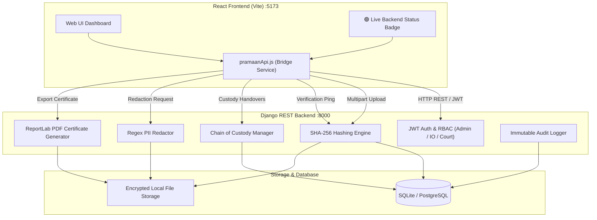

<div align="center">

# ⚖️ PRAMAAN (प्रमाण)
### Secure Digital Evidence & Legal Document Management System
**Smart India Hackathon (SIH) | Problem Statement ID: 26190**

[](https://www.python.org/)
[](https://www.djangoproject.com/)
[](https://react.dev/)
[](https://vitejs.dev/)
[-107c41)](#-qa-testing--sign-off)
[](#-key-features)
[](#)

*A production-ready, tamper-evident digital evidence lifecycle management platform ensuring legal admissibility, cryptographic chain of custody, and citizen data protection for Indian law enforcement and judiciary.*

---

</div>

## 📌 Problem Statement Overview (SIH PS 26190)

Digital evidence collection, handling, and court presentation face critical challenges:
- **Evidence Tampering**: Digital files can be subtly altered without leaving visible marks.
- **Broken Chain of Custody**: Lack of verifiable handovers between Investigating Officers (IO), Forensic Science Laboratories (CFSL), and Courts.
- **PII Exposure**: Seized evidence often contains sensitive citizen data (Aadhaar, PAN, phone numbers) that must be redacted before legal disclosure.
- **Unverified Exports**: Absence of machine-verifiable, legally admissible evidence certificates.

**PRAMAAN** solves this end-to-end with an automated cryptographic pipeline:
```
Upload ➔ SHA-256 Hash ➔ Custody Transfer ➔ Integrity Check ➔ Tamper Alert ➔ PII Redaction ➔ Court PDF Certificate ➔ Immutable Audit Log
```

---

## 🚀 System Architecture



---

## 🎯 Key Features Implemented

### 🛡️ Phase P0: Core Integrity & Tamper Detection
- **Cryptographic Ground-Truth Hashing**: SHA-256 computed at the instant of upload via Python `hashlib`.
- **Active Tamper Detection**: Compares server file checksum against stored hash; immediately identifies modified bytes.
- **Critical Automated Alerts**: Flags tampered files with `CRITICAL` severity in the audit log.
- **3-Tier Role-Based Access Control (RBAC)**:
  - 👑 **ADMIN**: User lifecycle, system oversight, audit inspection.
  - 👮 **IO (Investigating Officer)**: Upload evidence, verify hashes, initiate transfers, request certificates.
  - ⚖️ **COURT**: Read-only evidence inspection, search, and certificate verification.
- **Immutable Audit Trail**: Append-only audit logs recording every view, upload, verification, and tamper alert.

### ⛓️ Phase P1: Chain of Custody & Legal Evidence Certificate
- **Verifiable Custody Handovers**: IO $\rightarrow$ CFSL $\rightarrow$ Court transfer workflow with mandatory recipient confirmation and locked transfer-time hash snapshots.
- **Chronological Handover History**: Complete timeline tracking holder, location, date, and transfer purpose.
- **Government-Grade Legal PDF Certificate**:
  - Built dynamically using **ReportLab**.
  - Includes national emblem header, 64-character SHA-256 hash, integrity verdict banner, and custody timeline table.
  - Embedded diagonal `PRAMAAN CERTIFIED` watermark and unique serial number (`PRMN-CERT-YYYY-XXXXXX`).
  - Self-verifying checksum (SHA-256 of the generated PDF itself).

### 🔍 Phase P2: PII Redaction & Multi-Criteria Search
- **Indian-Specific PII Redaction Engine**: Pure regex engine with zero external model dependencies; detects:
  - 🪪 **Aadhaar** (`XXXX-XXXX-XXXX`)
  - 💳 **PAN** (`ABCDE1234F`)
  - 📱 **Mobile Numbers** (+91 / 0 / 10-digit Indian formats)
  - 📧 **Email Addresses**
  - 🗳️ **Voter IDs** & **Passports**
  - 👤 **Identifiable Names** with honorifics
- **Non-Destructive Redaction**: Original evidence remains bit-for-bit intact; a sanitized copy is generated (`[AADHAAR REDACTED]`, `[PAN REDACTED]`).
- **Advanced 10-Parameter Search**: Instant filtering by keyword (`q`), Case ID, status, date range, hash prefix, uploader, and cross-table flags (`has_pii`, `has_certificate`, `has_custody`).

---

## 📁 Repository Directory Structure

```text
PRAMAAN/
├── start_all.bat               # 🚀 One-click launcher (starts both servers & opens Chrome)
├── README.md                   # 📖 Master SIH Project Documentation
├── .gitignore                  # 🔒 Comprehensive Git ignore rules
│
├── PRAMAAN-BACKEND/            # ⚙️ Django REST Framework Backend
│   ├── manage.py               # Django CLI entrypoint
│   ├── requirements.txt        # Pinned Python dependencies
│   ├── start_server.bat        # One-click backend launcher
│   ├── run_demo.bat            # Automated P0 flow demo
│   ├── run_demo_p1.bat         # Automated P1 flow demo
│   ├── run_demo_p2.bat         # Automated P2 flow demo
│   ├── qa_full.py              # Full QA test suite (201 automated tests)
│   ├── pramaan_dev.sqlite3     # Seeded database with pre-configured demo users
│   ├── pramaan/                # Project root configuration (settings, urls, asgi, wsgi)
│   ├── apps/
│   │   ├── accounts/           # Custom User model, JWT authentication & RBAC
│   │   ├── documents/          # Document upload, storage & SHA-256 calculation
│   │   ├── verification/       # Hash comparison, tamper alerts & verdicts
│   │   ├── audit/              # Immutable audit logging & statistics
│   │   ├── custody/            # Chain of custody models, handovers & confirmation
│   │   ├── certificates/       # ReportLab PDF certificate generation & downloads
│   │   ├── redaction/          # Regex PII detection engine & redacted file generator
│   │   └── search/             # Advanced ORM document search & filtering
│   └── media/                  # Stored documents, certificates, and redacted copies
│
└── PRAMAAN-FRONTEND/           # 🎨 React 18 + Vite Web Application
    ├── package.json            # Node.js dependencies & scripts
    ├── vite.config.js          # Vite configuration
    ├── start_frontend.bat      # One-click frontend launcher
    ├── index.html              # HTML5 application mount
    ├── src/
    │   ├── main.jsx            # React root mount
    │   ├── App.jsx             # Top-level application component
    │   ├── services/
    │   │   └── pramaanApi.js   # Centralized HTTP bridge connecting to Django backend
    │   ├── core/
    │   │   └── pramaanRuntime.js # Application logic, state, and UI rendering
    │   └── styles/
    │       └── global.css      # Design system & backend connection badge styles
    └── docs/                   # Supporting documentation & reference notes
```

---

## ⚡ Quick Start Guide (Evaluator Walkthrough)

### Option A: One-Click Launch (Recommended for Windows)

Simply double-click the root batch script:
```bash
start_all.bat
```
This automatically:
1. Starts the **Django Backend** on `http://127.0.0.1:8000`.
2. Starts the **React Frontend** on `http://localhost:5173`.
3. Opens **Google Chrome** to the live connected application.

---

### Option B: Manual Setup

#### 1. Backend Setup
```bash
cd PRAMAAN-BACKEND
pip install -r requirements.txt
python manage.py migrate
python manage.py seed_demo    # Creates pre-configured demo users
python manage.py runserver
```
*Backend runs on `http://127.0.0.1:8000`*

#### 2. Frontend Setup
```bash
cd PRAMAAN-FRONTEND
npm install
npm run dev
```
*Frontend runs on `http://localhost:5173`*

---

## 🔑 Pre-Configured Demo Credentials

| Role | Username | Password | Access Scope |
| :--- | :--- | :--- | :--- |
| **ADMIN** | `admin` | `Admin@1234` | Full system control, user management, audit inspection |
| **IO** | `inspector_sharma` | `IO@12345` | Evidence upload, verification, transfers, certificates |
| **COURT** | `court_user` | `Court@1234` | Read-only evidence review, search, certificate validation |

---

## 🧪 QA Testing & Sign-Off

The platform includes an automated, rigorous end-to-end verification test suite:

```bash
cd PRAMAAN-BACKEND
python -X utf8 qa_full.py
```

### Test Results Summary:
```text
==============================================================
  PRAMAAN QA REPORT — FINAL SIGN-OFF
==============================================================
  Total Tests : 201
  Passed      : 201  (100%)
  Failed      : 0
  Warnings    : 0
==============================================================
  [SIGN-OFF] ALL TESTS PASSED. Production-ready for demo.
```

- **[AUTH]**: 12/12 Passed (JWT issuance, refresh, profile, invalid tokens)
- **[RBAC]**: 10/10 Passed (Strict permissions across Admin, IO, Court)
- **[DOC]**: 18/18 Passed (Uploads, downloads, MIME verification, hash storage)
- **[HASH]**: 15/15 Passed (SHA-256 uppercase hex, determinism, length)
- **[VERIFY]**: 15/15 Passed (Clean verification & real tamper byte injection detection)
- **[AUDIT]**: 15/15 Passed (Log creation, action breakdown, tamper alerts)
- **[CUSTODY]**: 25/25 Passed (Registration, transfer, confirmation, rejection)
- **[CERT]**: 20/20 Passed (PDF generation, watermark, valid `%PDF` magic bytes)
- **[PII]**: 33/33 Passed (Detection of 6 PII types, sanitization, raw data absence)
- **[SEARCH]**: 36/36 Passed (10 filter parameters, sorting, pagination)
- **[EDGE]**: 11/11 Passed (404s, 400s, 401s, self-transfers, bad inputs)

---

## 📡 REST API Reference

| Endpoint | Method | Role | Description |
| :--- | :---: | :---: | :--- |
| `/api/v1/auth/login/` | `POST` | Public | Authenticate user & obtain JWT tokens |
| `/api/v1/documents/upload/` | `POST` | IO, Admin | Upload evidence & compute ground-truth SHA-256 |
| `/api/v1/documents/` | `GET` | Authenticated | List all documents with pagination & status |
| `/api/v1/verification/{id}/verify/` | `POST` | IO, Admin | Re-hash file from disk and detect tampering |
| `/api/v1/custody/` | `POST` | IO, Admin | Register document into custody chain |
| `/api/v1/custody/{id}/transfer/` | `POST` | IO, Admin | Initiate evidence transfer with hash snapshot |
| `/api/v1/custody/transfer/{id}/confirm/`| `POST` | IO, Admin | Recipient confirms physical receipt of evidence |
| `/api/v1/certificates/generate/` | `POST` | IO, Admin | Generate official ReportLab PDF certificate |
| `/api/v1/certificates/{id}/download/` | `GET` | Authenticated | Stream verified PDF certificate |
| `/api/v1/redaction/detect/` | `POST` | IO, Admin | Scan document for sensitive Indian PII |
| `/api/v1/redaction/redact/` | `POST` | IO, Admin | Produce sanitized redacted file copy |
| `/api/v1/search/documents/` | `GET` | Authenticated | Multi-parameter search across all documents |
| `/api/v1/audit/` | `GET` | IO, Admin | View immutable security audit logs |

---

## 🏆 SIH Team & Submission Information

- **Smart India Hackathon (SIH) 2026**
- **Problem Statement ID**: 26190
- **Project Name**: PRAMAAN (Secure Digital Evidence Management System)
- **GitHub Repository**: [Mainak-koley/PRAMAAN-SECURE](https://github.com/Mainak-koley/PRAMAAN-SECURE.git)

---

<div align="center">
  <b>Built with precision for the Smart India Hackathon</b><br>
  <i>Ensuring integrity, authenticity, and justice through secure digital evidence.</i>
</div>
